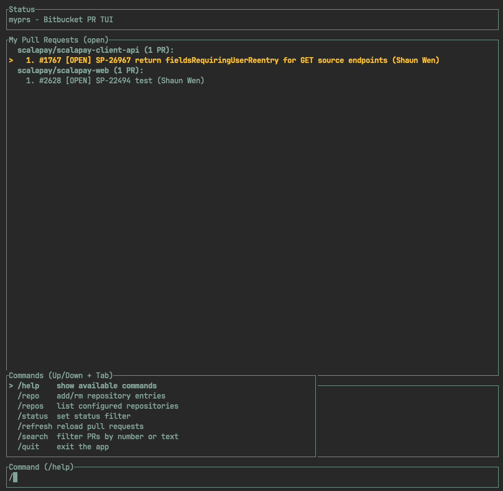

# myprs

`myprs` is a terminal UI for viewing Bitbucket pull requests authored by you across multiple repositories.

It uses Bitbucket API token authentication via HTTP Basic auth (`email + api token`) and stores local settings in `~/.config/myprs/config.toml`.

## UI Preview



## Features

- Fetch PRs you created across one or many repos.
- Group PRs by repository in the main list.
- Filter by PR status: `open`, `merged`, `declined`, `all`.
- Search loaded PRs by PR number or text in title/description.
- Auto-refresh PRs and alert on updates (comments, state, activity).
- Show comment counts for each PR in the list.
- Auto-refresh PR data every 120 seconds.
- Notify on detected PR updates (comment count, state, and activity changes) using terminal bell.
- Manage repositories directly from the TUI.
- Open selected PR in your browser from the TUI.

## Requirements

- macOS, Linux, or another terminal environment supported by `crossterm`.
- Bitbucket account email and API token.

## Quick Start

1. Install via Homebrew:

```bash
brew install shaunwen/tap/myprs
```

2. Set credentials:

```bash
export BITBUCKET_EMAIL="you@company.com"
export BITBUCKET_API_TOKEN="<atlassian-api-token>"
```

3. Set repositories (recommended):

```bash
export BITBUCKET_REPOS="workspace-a/repo-1,workspace-b/repo-2"
```

4. Optional: set refresh cadence (seconds, default `120`):

```bash
export BITBUCKET_AUTO_REFRESH_SECONDS=120
```

5. Run:

```bash
myprs
```

## CLI Options

You can override or add settings at startup:

```bash
myprs \
  --email you@company.com \
  --api-token <token> \
  --repo workspace-a/repo-1 \
  --repo workspace-b/repo-2 \
  --status open \
  --auto-refresh-seconds 120
```

## TUI Commands

- `/help`
- `/repo add <workspace>/<repo>`
- `/repo rm <workspace>/<repo>`
- `/repos`
- `/status <open|merged|declined|all>`
- `/refresh` (run an immediate refresh and show update notifications)
- `/search <text|pr-number>`
- `/search clear`
- `/quit`

## Auto-Refresh and Update Notifications

- Refresh interval defaults to `120` seconds.
- Configure the interval with:
  - env var: `BITBUCKET_AUTO_REFRESH_SECONDS`
  - CLI flag: `--auto-refresh-seconds`
  - config file key: `auto_refresh_seconds`
- `auto_refresh_seconds` must be a positive integer (`>= 1`).
- On each refresh, `myprs` compares the latest PR snapshot against the previous one and detects:
  - comment count changes
  - state changes
  - new activity (`updated_on` changed)
  - newly appeared / disappeared PRs in the current status filter
- When updates are detected, `myprs`:
  - logs an update summary in the TUI log panel
  - emits a terminal bell (`\x07`)
- The first load only fetches data; notifications are emitted on subsequent refreshes (auto or `/refresh`).

## Keybindings

- `Up` / `Down`: move selection (or command suggestion selection in command mode)
- `Tab`: apply selected command suggestion
- `Enter` on empty command input: open selected PR in browser
- `Esc` or `Ctrl+C`: quit

## Example `config.toml`

`myprs` persists runtime config to `~/.config/myprs/config.toml`.

```toml
bitbucket_email = "you@company.com"
bitbucket_api_token = "<atlassian-api-token>"
default_status = "open"
auto_refresh_seconds = 120

[[repos]]
workspace = "workspace-a"
repo = "repo-1"

[[repos]]
workspace = "workspace-b"
repo = "repo-2"
```

## Release Binary (macOS ARM64)

This repository includes a GitHub Actions workflow that builds and uploads a macOS ARM64 binary on tag pushes:

- Workflow file: `.github/workflows/release-macos-arm64.yml`
- Trigger: push tag like `v0.1.1`
- Output asset: `myprs-v0.1.1-aarch64-apple-darwin.tar.gz` and matching `.sha256`

Release flow:

```bash
git tag -a v0.1.1 -m "v0.1.1"
git push origin v0.1.1
```

To verify architecture from a downloaded asset:

```bash
tar -xzf myprs-v0.1.1-aarch64-apple-darwin.tar.gz
file myprs
```

Expected output includes `arm64`.
